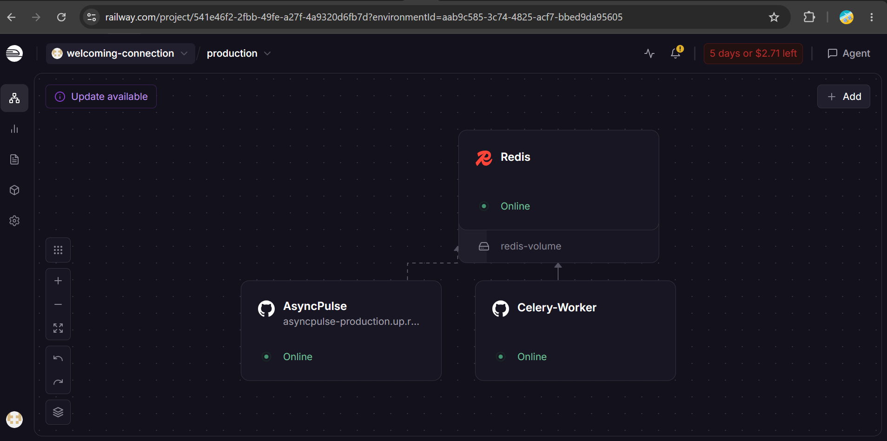

# ⚡ AsyncPulse: Production-Grade Asynchronous Task & Webhook Engine

[](https://www.python.org/)
[](https://www.djangoproject.com/)
[](https://docs.celeryq.dev/)
[](https://redis.io/)
[](LICENSE)

**AsyncPulse** is a scalable, reliable, fault-tolerant, and observable background task execution engine built using **Django 5, Celery 5, Redis, and Django REST Framework**. It is designed to handle high-concurrency background job processing, automated webhook dispatching with retries, and real-time task status tracking without blocking the main application interface.

---

## 🖥️ Live Operational Dashboard Showcase

### 1. Webhook Dispatcher & Health Monitor Interface
Interactive control center displaying real-time system health checks (Database & Redis connection status) alongside the webhook task dispatcher:


### 2. Live Task Stream & Asynchronous Worker Execution
Real-time polling stream showcasing active task execution (`STATUS: 200 SUCCESS`), unique task tracking UUIDs, and live JSON payload responses processed by Celery workers:


---

## ☁️ Cloud Infrastructure & Deployment Topology

AsyncPulse is deployed using a decoupled microservices pattern on Railway to guarantee high availability and fault isolation in production.



- **Django Web Node (`AsyncPulse`):** Serves incoming REST API endpoints, handles request validation, and pushes asynchronous jobs to the message broker.
- **Redis Message Broker:** Acts as the high-throughput in-memory queue manager, buffering background jobs and task payloads.
- **Celery Background Workers:** Independent execution workers that consume jobs from Redis, execute background processes, handle exponential retries, and store execution results.

---

## 🚀 Key Features

- **Asynchronous Webhook Engine:** Automated external webhooks delivery pipeline powered by Celery with exponential backoff retries.
- **Task Throttling & Rate Limiting:** Strictly enforces per-task execution limits (e.g., 10 tasks/minute) to prevent server exhaustion and downstream API rate limits.
- **Task Status Tracking:** Live background task status polling (`PENDING`, `STARTED`, `SUCCESS`, `FAILURE`) using `AsyncResult` integration.
- **System Observability & Diagnostics:** Health check API (`/api/health/`) inspecting DB & Redis connection health in real-time.
- **Automated Cleanups:** Scheduled daily purging of old task execution records via **Celery Beat** to keep the database lightweight and optimized.

---

## 🛠 Tech Stack & Architecture

- **Backend Framework:** Django 5.x & Django REST Framework (DRF)
- **Task Queue:** Celery 5.x
- **Message Broker:** Redis
- **Result Backend:** `django-celery-results` (Database Backend)
- **Authentication:** JWT (SimpleJWT)
- **Frontend UI:** React.js / Vite Operational Dashboard (Deployed on Vercel)
- **Deployment & Cloud Hosting:** Railway (Django Web Service, Celery Worker, Redis)

---

## ⚙️ Local Setup Instructions

### 1. Repository Clone & Environment Setup
```bash
git clone [https://github.com/waqas-ayub/AsyncPulse.git](https://github.com/waqas-ayub/AsyncPulse.git)
cd AsyncPulse

# Create virtual environment
python -m venv venv

# Activate virtual environment
.\venv\Scripts\Activate.ps1   # Windows PowerShell
# source venv/bin/activate     # Linux/macOS
